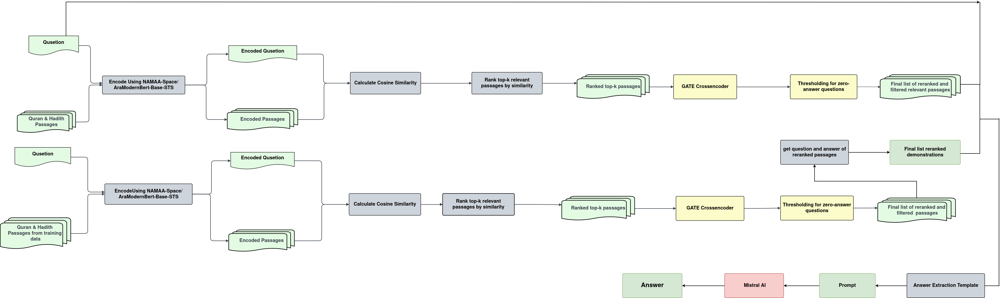

<p align="center">
  
</p>

<h1 align="center">End-to-End Islamic Question Answering System</h1>

<p align="center">
<b>Evidence-Grounded Arabic Question Answering over the Qur’an and Hadith</b>
</p>

<p align="center">
  
  
  
  
  <a href="https://arxiv.org/abs/XXXX.XXXXX">
    
  </a>
</p>

---

## 📘 Introduction

Islamic Question Answering requires high factual accuracy, source faithfulness, and strict grounding in authoritative religious texts.  
This project presents a complete end-to-end Arabic QA system designed to answer religious questions using the Holy Qur’an and Hadith as primary knowledge sources.

The system integrates retrieval-augmented generation with in-context learning to produce reliable, evidence-based responses while minimizing hallucinations.

---

## 🎯 Objectives

- Provide accurate Arabic answers grounded in Qur’an and Hadith  
- Reduce hallucinations in large language model outputs  
- Improve answer reliability through evidence-based reasoning  
- Leverage retrieval and reranking for high-quality context selection  
- Enhance model performance using retrieval-driven in-context learning  

---

## 🏗️ System Overview

<p align="center">
  
</p>

The system pipeline consists of four major stages:

1. Passage Retrieval  
2. Passage Reranking  
3. Demonstration Selection for In-Context Learning  
4. Evidence-Constrained Answer Extraction  

---

## 🔬 Methodology

### 🔎 Retrieval

- The input question is encoded using a sentence embedding model.  
- Qur’anic verses and Hadith passages are encoded offline.  
- Cosine similarity is computed to retrieve top-K semantically relevant passages.  

This stage ensures broad semantic coverage and high recall.

---

### 🧠 Reranking

Retrieved passages are refined using **NAMAA Space GATE Reranker V1**, a cross-encoder based on AraBERT.

Key characteristics:

- Joint encoding of question–passage pairs  
- Cross-attention modeling for contextual interactions  
- Training using Arabic Triplet Matryoshka strategy  
- Fine-grained relevance scoring  

This improves evidence precision and removes irrelevant candidates.

---

### 🧪 In-Context Learning

In-Context Learning (ICL) enables task adaptation through prompt demonstrations without updating model parameters.

Demonstration selection pipeline:

1. Retrieve candidate passages from the training dataset  
2. Rerank candidates using the GATE model  
3. Select top-ranked passages  
4. Extract their corresponding question–answer pairs  
5. Use them as in-context demonstrations  

This ensures demonstrations are semantically and contextually aligned with the input question.

---

### ✨ Answer Extraction

Answer generation is performed using a Mistral-based large language model.

The model is constrained to extract answers only from retrieved evidence.

#### Prompt Structure

**In-Context Demonstrations**

- Context  
- Question  
- Answer  

**Test Instance**

- Question: user input  
- Context: top-K reranked passages  
- Answer: generated by the model  

This structured prompting enhances factual grounding and reduces hallucination.

---


### Requirements

- Python 3.10  
- Mistral AI API  

### Libraries

```bash
pip install huggingface_hub==0.13.4
pip install -U sentence-transformers
pip install faiss-cpu

```

## 🚀 Installation

### Clone Repository

```bash
git clone https://github.com/Shymaa2611/End-to-end-Islamic-Question-Answering-System-Generation.git
cd End-to-end-Islamic-Question-Answering-System-Generation

```

### Create Virtual Environment

```bash

python -m venv venv
source venv/bin/activate
venv\Scripts\activate

```

### Install Dependencies

```bash

pip install -r requirements.txt

```
## ▶️ Running the System

### Demonstration Selection

```bash

python src/in_Context_learning/retrieve_demonstrations.py

```

## 📊 Evaluation

```bash

python src/Evaluation/eval.py

```

## 📝 Conclusion

This project introduces a structured, evidence-grounded Islamic QA framework that combines retrieval, reranking, in-context learning, and constrained LLM generation.
The architecture ensures factual reliability, contextual relevance, and faithfulness to Qur’anic and Hadith sources while providing a scalable foundation for Arabic religious question answering systems.